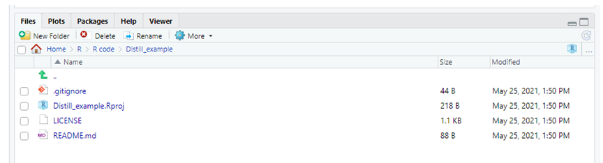
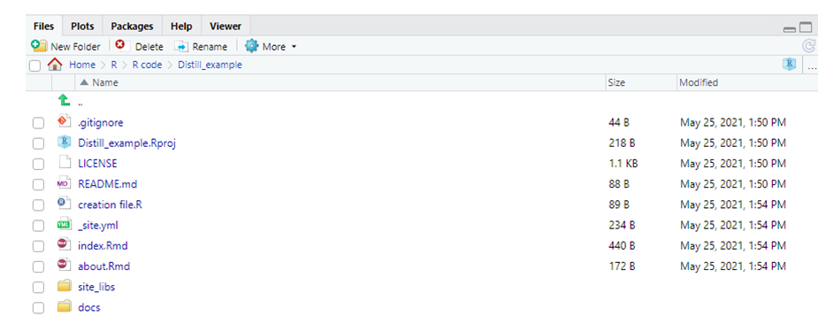
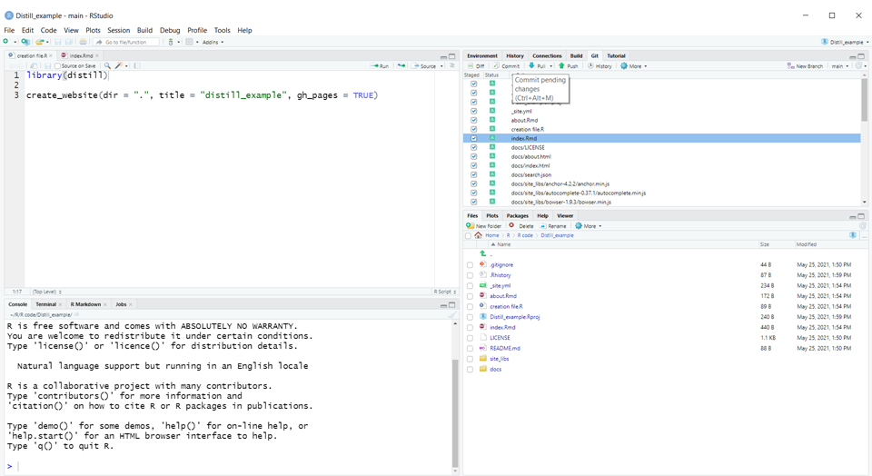
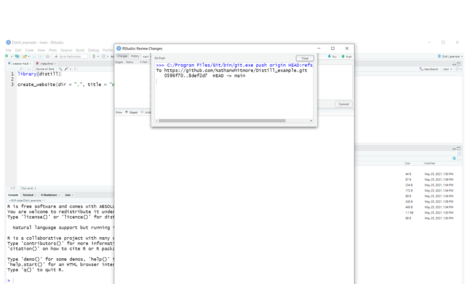
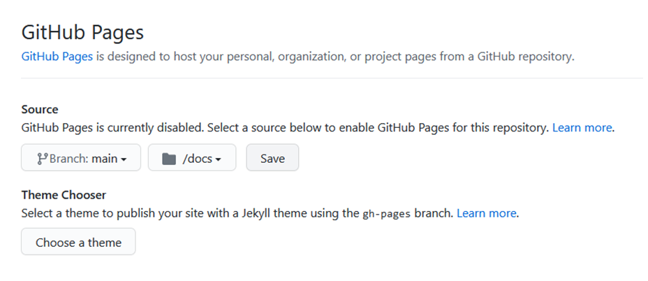
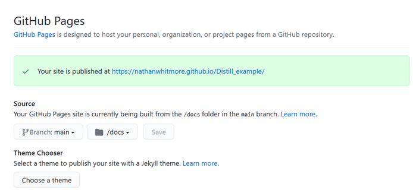

# Summary
We can create great free reproducible websites using Rstudio, the distill package and GitHub pages. Furthermore, by using GitHub as our code repository we can ensure that our code is safe, and that we can roll back changes if we damage our code. There are a variety of ways to create a distill website but this is the one that works well for me.

Indeed this website was created from the code and the steps given below.

<br>

# Getting started
In order to get started we will need to be registered on GitHub and have RStudio and R installed on our computer. The distill package will also need to be installed (see <https://rstudio.github.io/distill/website.html>). 

The main code for the layout of the website will be written in Rmarkdown (a good introduction can be found here <https://rmarkdown.rstudio.com/.)

<br>

## Create repository

We begin by creating a new GitHub repository, giving the project a description, a readme file, and a license. This basically creates a place on the internet for our files.


<br> 

## Copy URL 

Go the green radio button and copy the URL. We will need pass this information to RStudio so it knows where to put the files.


<br>


## Install 'distill' package

Install the 'distill' package in R either via the 'Packages' pane or via code

```{r eval = FALSE}
install.packages("distill")
```

<br>

## New project via Version Control
Next we create a new project using the 'Version Control' option. This allows us to link our GitHub URL to our RStudio project.


<br>

### Choose Git


<br>

### Paste URL


RStudio now 'pulls' the pre-exising files from your GitHub URL into your project folder. You will see the files appear in your environment pane.



<br>

## Render website 

Next we run the following code to create a website that can be displayed on GitHub pages.

```{r eval = FALSE}
library(distill)

create_website(dir = ".", title = "distill_example", gh_pages = TRUE)
```

This will then render the files required for a simple website including a home and about tab.




You will then be presented with your index.Rmd (RMarkdown) file which forms your website's home page. The top portion of your RMarkdown file, bounded by '---''s is contains the YAML script which defines the look of a particular page. This can be altered to customise some aspects of its layout.


<br>

### Close the project

Next close the project and reopen it. 

<br>

## Build the website

A build tab should now appear in the top right hand corner pane. Click on it. On the left hand side you will see a hammer icon. Click on it and your website be rendered by RStudio. If you fully opne the window you will see an option in the top right hand side to view the website in your browser. this will give a good indication of its final look.

<br>


## Commit changes to GitHub

Now when we click on the Git tab up on the right hand side, we will see there a list is compiled of the the file changes we have made since we first 'pulled' from GitHub.  What we want to do is 'commit' these changes to GitHUb, which means that these changes will be changed when we next 'push' the changes to out repository. To do this we tick all the files we want updated (which is all of them) and then press the commit button.



We will then we asked to add a comment (which will help us track the changes we make). Now, it is important to know that nothing will update on the GitHub site until we press the push button. Once we press the push button the window we see something like:




<br>

## Return to your GitHub repository

Now we return to our GitHub repository and check to see whether these changes have been made. This can take a couple of minutes.


<br>

## Go to GitHub settings

### Set source files

The next step is to go your repository's GitHub settings and scroll down to GitHub pages (this may send you to a new page). There you will need to tell GitHub where your source files are located. Because of the way we have created the website these will be located on your main branch in your docs folder. Make this selection and then save.




### Copy the public URL

Now that you have done that you will see highlighted text appears saying "Your site is ready to be published at...". 



<br>

Copy the URL to your browser.

# Admire your website

Be patient -- it may take 10-15 minutes for your website to appear. Take time out to enjoy this little success. What you see should look something like:


